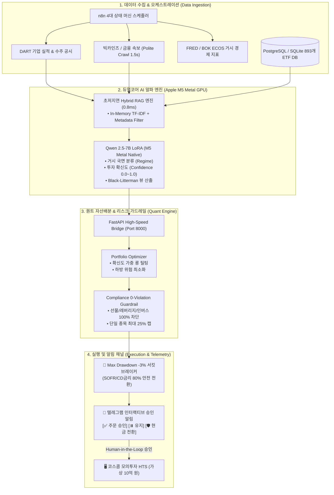
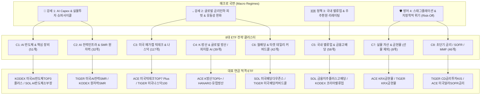
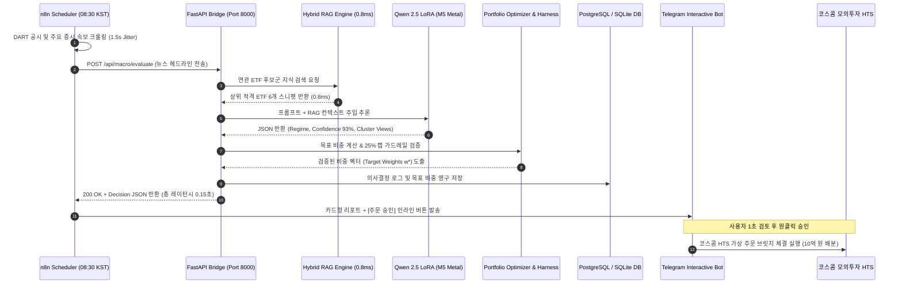
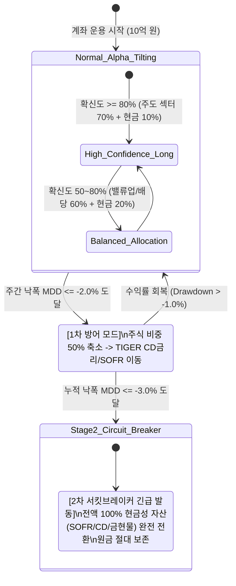

# 🏛️ 머니투데이 ETF 투자왕 대회 [연금형] 시스템 아키텍처 다이어그램 (Mermaid Spec)

본 문서는 연금형 ETF AI 퀀트 시스템의 **데이터 흐름, 지식 그래프, 멀티에이전트 시퀀스, 리스크 상태 머신**을 시각화한 머메이드(Mermaid) 명세서입니다.

---

## 1. 🌐 엔드투엔드 시스템 토폴로지 (End-to-End System Topology)

---

## 2. 🕸️ 8대 클러스터 온톨로지 지식 그래프 (Knowledge Graph & Router)

---

## 3. ⏱️ 멀티에이전트 실시간 오케스트레이션 시퀀스 (Sequence Flow)

---

## 4. 🚨 리스크 관리 & 서킷브레이커 상태 머신 (Risk State Machine)

