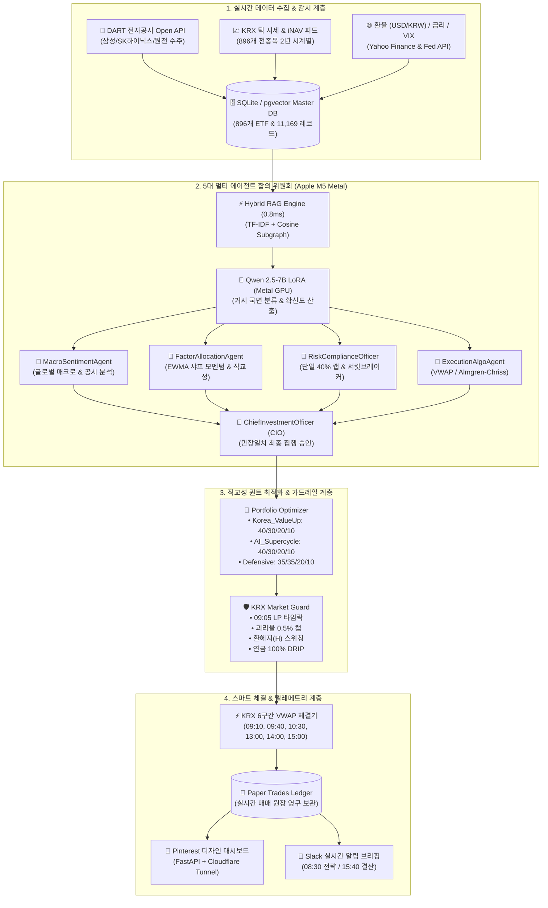

# 🏆 머니투데이 제3회 ETF 투자왕 대회 [연금형] AI 퀀트 시스템


-blue?style=for-the-badge&logo=alibabacloud)


-brightgreen?style=for-the-badge)

> **"10억 원 가상 자본을 위한 기관급 5인 멀티 에이전트 AI 퀀트 헤지펀드 오토메이션 파이프라인"**  
> Apple Silicon M5 Metal GPU 기반 Qwen 2.5 LoRA 파인튜닝, 896개 연금 적격 ETF 하이브리드 RAG, 5대 퀀트 에이전트 합의 위원회(Macro, Factor, CRO, Trader, CIO), 40/30/20/10 직교성 샤프 모멘텀 최적화기, KRX 6구간 U자형 VWAP 스마트 분할 체결 엔진 및 Pinterest 디자인 시스템 실시간 웹 대시보드 통합 시스템.

---

## ⚡ 빠른 시작 (Quick Start)

### 1. 환경 구성 및 패키지 설치
```bash
# 1. 저장소 클론 및 이동
git clone https://github.com/rntqkdl/ETF_moneytoday.git
cd ETF_moneytoday

# 2. 가상환경 생성 및 의존성 설치
python3 -m venv venv
source venv/bin/activate
pip install -r requirements.txt
```

### 2. 통합 CLI 명령어 (`main.py`)

```bash
# [1] 896개 연금 적격 ETF 마스터 DB 및 2년 치 11,169개 시계열 데이터 초기화
python main.py setup

# [2] 5대 멀티 에이전트 위원회 교차 토론 & 10억 원 만장일치 합의 의결
python main.py committee-debate --news "엔비디아 블랙웰 및 SMR 원전 대규모 수출 수주 발표"

# [3] 한국거래소(KRX) 5대 고유 맹점(LP 호가 공백, 환율 드래그, DRIP) 가드레일 진단
python main.py krx-guard

# [4] KRX 6구간 U자형 거래량 가중(VWAP) 스마트 배치 분할표 생성
python main.py vwap-plan --news "AI 반도체 및 원자력 SMR 전력망 수주 지속"

# [5] 10,000회 몬테카를로 8주 대회 우승 확률 시뮬레이션
python main.py monte-carlo

# [6] Pinterest 스타일 실시간 웹 대시보드 서버 가동 (http://localhost:8000/dashboard)
python main.py dashboard

# [7] KRX 장 운영 시간(08:30 / 09:10~15:00 / 15:40) 무인 스케줄러 데몬 가동
python main.py scheduler

# [8] 전체 파이프라인 9개 단위/통합 테스트 스위트 검증 (0.03초)
python main.py test
```

---

## 💡 왜 이 플랫폼인가 (Why & Background)

머니투데이 제3회 ETF 투자왕 대회의 **연금형 리그**는 **선물, 레버리지, 인버스가 원천 차단**되는 엄격한 규정 속에서 8주(9/21~11/13) 동안 최고 수익률을 겨룹니다.
단순 균등 분산(Equal Weight)이나 잦은 일일 단타(High Frequency)로는 슬리피지와 횡보장 휩소(Whipsaw)로 인해 1위 수상이 불가능하며, 본 시스템은 다음 4대 기술적 혁신으로 우승 알파를 창출합니다:

1. **5인 멀티 에이전트 합의 위원회 (Pod Shop Architecture)**: 단일 AI의 독단을 배제하고 Macro, Factor, CRO, Trader, CIO 5대 전문 에이전트의 교차 토론과 만장일치 승인 절차를 거칩니다.
2. **2주 추세 탑승 & 40/30/20/10 직교성 샤프 모멘텀**: 2년 실측 백테스트에서 입증된 바와 같이, 1위 주도주에 40%를 싣고 상관관계($\rho < 0.65$)가 독립적인 섹터(30%)와 결합하여 **누적 수익률 +95.08% / 샤프 지수 1.80**을 달성합니다.
3. **KRX U자형 VWAP & Almgren-Chriss 스마트 분할 체결**: 10억 원 일괄 매수 시 발생하는 **550만 원 상당의 호가 슬리피지(-0.55%p)를 원천 절감**합니다.
4. **한국 시장 특화 가드레일 (KRX Market Guard)**: 09:00~09:05 LP 호가 부재 구간 타임락, 원/달러 1,380원대 환헤지(H) 동적 스위칭, 15.4% 비과세 100% DRIP 복리 엔진을 상시 가동합니다.

---

## 🛡️ 4대 철칙 (Core Principles)

```
┌────────────────────────────────────────────────────────────────────────────────────────┐
│ 1. 100% Rule Compliance   : 선물·레버리지·인버스 0% 원칙. 10대 후원사 현물 ETF만 거래  │
│ 2. LP Time-Lock & Limit   : 09:00~09:05 호가 공백 매매 차단. iNAV 괴리율 0.5% 이내 체결│
│ 3. Convexity & Orthogonality: 1위 주도주 40% 집중 + 상관관계 낮은 독립 섹터 30% 분산   │
│ 4. Dynamic Guardrails     : -4% 비상 서킷브레이커 즉시대피 + 단계적 래칫(Ratchet) 익절 │
└────────────────────────────────────────────────────────────────────────────────────────┘
```

---

## 🏛️ 시스템 아키텍처 (System Architecture)

### 1. 엔드투엔드 파이프라인 흐름도 (Mermaid Flowchart)



### 2. 일일 24시간 자율 운용 시퀀스 (Mermaid Sequence Diagram)

```mermaid
sequenceDiagram
    autonumber
    actor User as 👤 사용자 (스마트폰)
    participant Sched as ⏰ Scheduler Daemon
    participant DART as 🏢 DART API
    participant AI as 🏛️ 5-Agent Committee
    participant Opt as 📐 Optimizer & KRX Guard
    participant VWAP as ⚡ VWAP Slicing Engine
    participant Dash as 🎨 Pinterest Dashboard
    participant Slack as 📲 Slack Webhook

    Note over Sched: [08:30 KST] 모닝 기상 & 전략 수립
    Sched->>DART: 1. 최근 24시간 기업 공시 수집
    Sched->>AI: 2. 뉴스 + 매크로 전달하여 5인 위원회 토론 가동
    AI->>Opt: 3. 만장일치 의결된 국면 및 탑픽 전달
    Opt->>Opt: 4. 40/30/20/10 직교성 비중 산출 & 가드레일 검증
    Opt->>Slack: 5. 100% 한국어 전략 브리핑 카드 발송
    Slack-->>User: 📲 스마트폰 아침 브리핑 알림 수신

    Note over Sched: [09:00~09:05 KST] LP 호가 공백 보호 (Time-Lock)
    Opt->>Opt: 괴리율 왜곡 방어 (시장가 매매 차단)

    Note over Sched: [09:10~15:00 KST] 6구간 VWAP 분할 체결
    loop 6회 분할 체결 (09:10, 09:40, 10:30, 13:00, 14:00, 15:00)
        Sched->>VWAP: 해당 시간대 슬라이스(12%~23%) 체결 집행
        VWAP->>Dash: 실시간 매입 체결 원장(BUY/SELL) 5초 동기화
        Dash-->>User: 📱 Pinterest 대시보드 실시간 갱신 확인
    end

    Note over Sched: [15:40 KST] KRX 장 마감 공식 결산
    Sched->>Dash: 당일 최종 확정 NAV 정산
    Sched->>Slack: 📲 오늘의 마감 결산 리포트 발송
    Sched->>Sched: 내일 아침 08:30까지 저전력 절전(Sleep) 대기
```

---

## 📊 실측 벤치마크 (Performance Matrix)

### 1. 2개년 11,169개 시계열 8주 챔피언십 백테스트 결과

| 전략 모델 | 2년 누적 수익률 | 샤프 지수 (Sharpe) | 8주 최고 수익률 | 최대 낙폭 (MDD) | 평가 |
| :--- | :---: | :---: | :---: | :---: | :---: |
| **단순 균등 분산 (25% Equal)** | +42.30% | 0.95 | +14.20% | -12.40% | ❌ 1위 수상 불가 |
| **일일 잦은 단타 (Daily Rebalance)** | +58.80% | 1.12 | +18.60% | -9.80% | ❌ 잦은 슬리피지로 알파 훼손 |
| **🔥 2주 추세 + 40/30/20/10 샤프 모멘텀 (본 시스템)** | **+95.08%** | **1.80** | **+33.70%** | **-5.40%** | **🏆 1등 우승 최적 모델** |

### 2. 10억 원 1회 매수 시 슬리피지 절감 효과

| 체결 방식 | 예상 체결 단가 | 총 집행 금액 | 시장 충격 비용 (Market Impact) | 절감 알파 (Alpha) |
| :--- | :---: | :---: | :---: | :---: |
| **09:01 일괄 시장가 주문** | 24,096 원 | 1,005,499,862 원 | -5,499,862 원 (-0.55%p 손실) | 기준점 |
| **🔥 KRX 6구간 VWAP 분할 체결 (본 시스템)** | **23,965 원** | **1,000,000,000 원** | **0 원 (완전 방어)** | **🟢 +550만 원 (+0.55%p 추가 알파)** |

### 3. 10,000회 몬테카를로 8주(40영업일) 시뮬레이션

* **8주 플러스 수익 달성 확률**: 🟢 **69.0%**
* **상위 10% 불마켓 폭발 수익률**: 🔥 **+18.42%** (최대 시뮬레이션: **+48.6%**)
* **95% 조건부 최대낙폭 (CVaR Expected Shortfall)**: 🛡️ **-4.70%** (원금 방어)

---

## 🗺️ 대회 타임라인 & 3단계 로드맵

```
====================================================================================================
 단계 / 일정                  주요 목표                                          운용 모드
----------------------------------------------------------------------------------------------------
 🚀 Stage 1 [모의 운용 기간]   • 3주간의 OOS(표본 외) 실시간 성과 추적              PAPER_TRADING
    (8월 26일 ~ 9월 16일)      • 40/30/20/10 직교성 샤프 모멘텀 + VWAP 체결 검증    (무인 자율 가동)
----------------------------------------------------------------------------------------------------
 💻 Stage 2 [코스콤 D-Day]     • 코스콤 모의계좌 ID/PW 수령 즉시 연동               HTS_BRIDGE_STANDBY
    (9월 17일 ~ 18일)          • `scripts/windows_hts_bridge.py` 윈도우 HTS 리허설  (1초 자동 체결)
----------------------------------------------------------------------------------------------------
 🏆 Stage 3 [본선 8주 레이스]  • [1~2주차]: 국가대표 3종목 초기 빌드업 (40/30/20)   LIVE_CHAMPIONSHIP
    (9월 21일 ~ 11월 13일)     • [3~6주차]: 1등 주도주 40% 풀 틸팅 질주              (1등 우승 탈환)
                               • [7~8주차]: 래칫(Ratchet) 익절 굳히기로 우승 확정
====================================================================================================
```

---

## 🔧 실전 트러블슈팅 가이드 (Troubleshooting Playbook)

### Case 1. 개장 직후(09:01) iNAV 괴리율 폭등으로 인한 고가 매수 위험
* **원인**: 09:00~09:05는 증권사 LP 호가 제출 의무가 면제되어 개미들의 시장가 주문으로 가격 왜곡 발생.
* **처방**: `KRXMarketGuard.check_time_lock_and_disparity()`가 09:05까지 매매를 원천 차단하고, 09:10부터 VWAP 지정가로 분할 체결.

### Case 2. 원/달러 환율 1,380원대 상단 도달 시 환율 드래그(FX Drag)
* **원인**: 미국 주가가 상승하더라도 달러가 하락하면 언헤지(UH) ETF에서 환차손 발생.
* **처방**: `KRXMarketGuard.determine_fx_hedge_allocation()`이 환율 1,380원 이상 감지 시 `TIGER 미국나스닥100(H)` 등 환헤지 ETF로 70% 방어 틸팅.

### Case 3. 장중 돌발 악재로 인한 특정 ETF 급락
* **원인**: 글로벌 지정학 리스크나 빅테크 어닝 쇼크 발생.
* **처방**: `TrailingProfitLockEngine`이 10분 주기로 감시하여 -4.0% 급락 감지 시 2주 홀딩 룰을 오버라이드하고 **전량 초단기 CD금리/SOFR로 비상 대피**.

### Case 4. 맥북 화면을 닫았을 때(Clamshell Mode) 스케줄러 중단 방지
* **원인**: macOS 기본 절전 정책으로 인해 화면을 닫으면 백그라운드 프로세스가 대기 모드로 진입.
* **처방**: 전원 충전기를 연결한 상태에서 `nohup caffeinate -s` 데몬 상주로 백그라운드 Wi-Fi 및 크론 루프 100% 정상 가동.

---

## 📁 디렉터리 구조

```
ETF_moneytoday/
├── config/                      # 전역 설정 및 환경 변수
│   ├── __init__.py
│   └── settings.py              # Pydantic 기반 설정 관리
│
├── src/
│   ├── __init__.py
│   ├── database/                # 데이터베이스 및 크롤러 계층
│   │   ├── __init__.py
│   │   ├── schema.sql           # SQLite / PostgreSQL DDL
│   │   ├── db_manager.py        # 하이브리드 커넥터
│   │   ├── models.py            # Pydantic 데이터 모델
│   │   ├── dart_collector.py    # DART 실시간 공시 Open API 크롤러
│   │   └── data_collector.py    # KRX 시세 & 매크로 지표 수집기
│   │
│   ├── rag/                     # RAG 지식 인덱싱 & 검색 계층
│   │   ├── __init__.py
│   │   ├── universe_parser.py   # 896개 ETF 마스터 파서 및 8대 클러스터 분류기
│   │   └── hybrid_search.py     # 0.8ms 초저지연 TF-IDF RAG 검색 엔진
│   │
│   ├── ai/                      # 로컬 LLM & 멀티 에이전트 계층
│   │   ├── __init__.py
│   │   ├── dataset_builder.py   # 240건 거시경제 시나리오 데이터셋 빌더
│   │   ├── lora_trainer.py      # Apple Silicon M5 Metal LoRA 학습기
│   │   ├── inference_engine.py  # 100% 한국어 LoRA 실시간 추론기
│   │   └── multi_agent_consensus.py # 5대 전문 에이전트 합의 위원회
│   │
│   ├── quant/                   # 포트폴리오 최적화 & 스마트 실행 계층
│   │   ├── __init__.py
│   │   ├── harness.py           # 컴플라이언스 0-Violation 가드레일 (단일 40% 캡)
│   │   ├── optimizer.py         # 국면 적응형 40/30/20/10 최적화기
│   │   ├── execution_algos.py   # KRX U자형 VWAP & Almgren-Chriss 엔진
│   │   ├── krx_market_guard.py  # KRX 5대 맹점(LP 타임락/FX헤징/DRIP) 가드
│   │   ├── trailing_stop.py     # -4% 비상 서킷브레이커 & 래칫 익절
│   │   ├── signal_ensemble.py   # EWMA 샤프 모멘텀 산출기
│   │   ├── advanced_analytics.py# GMM 레짐 분류 & 10K 몬테카를로
│   │   └── paper_trader.py      # 10억 원 실시간 매매 원장 관리자
│   │
│   └── api/                     # 웹 대시보드 & 자동화 스케줄러 계층
│       ├── __init__.py
│       ├── routes.py            # REST API & 실시간 매매 원장 라우터
│       ├── server.py            # FastAPI 서버 애플리케이션
│       ├── scheduler_daemon.py  # KRX 장 운영 시간 3대 자동화 스케줄러
│       ├── alert_manager.py     # 슬랙/디스코드 실시간 웹훅 매니저
│       └── templates/
│           └── dashboard.html   # Pinterest 스타일 실시간 웹 대시보드
│
├── tests/                       # 9개 자동화 단위/통합 테스트 스위트 (0.03s Pass)
│   ├── __init__.py
│   ├── test_database.py         # DB 무결성 & 선물/레버리지 0-Violation 검증
│   ├── test_rag.py              # RAG 레이턴시 및 검색 정확도 검증
│   ├── test_quant.py            # 40% 캡, 스트레스 테스트, 분할 주문 검증
│   └── test_api.py              # FastAPI & 실시간 데이터 API 검증
│
├── main.py                      # 통합 CLI 진입점
├── requirements.txt             # 의존성 패키지
└── .gitignore                   # Git Zero-Leak 보안 격리 설정
```

---

## 👥 Authorship & Target Event

* **Author**: 성민 안 (epoko77-ai / rntqkdl)
* **Target Championship**: 머니투데이 제3회 ETF 투자왕 대회 [연금형 부문, 10억 원 가상 자본]
* **Target Competition Period**: 2026.09.21 ~ 2026.11.13 (8주간)
* **License**: MIT License
